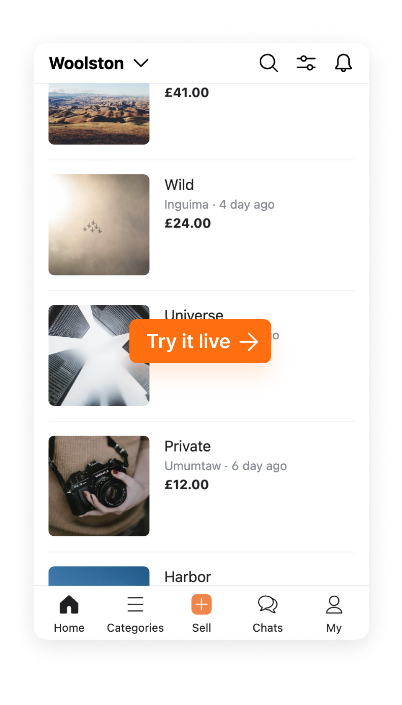

<div align="center">

<a href="https://stackflow.so/" target="_blank">



</a>


    

</div>

## Introduction

> Karrotframe is rebranded with **"Stackflow"**. View full documentation and demo on [https://stackflow.so](https://stackflow.so/)

**Stackflow** is a project that implements Stack Navigation UX, which is mainly used in mobile devices (iOS/Android, etc.) in a JavaScript environment. So, it can help to easily develop hybrid apps and webviews.

- Stack screens and keep scrolling state.
- It supports transition effects that stack up the screen and the transition effect that disappears when you go back.
- Supports iOS-style swipe back.
- It passes the necessary parameters to the screen to be switched.

So, what advantages does **Stackflow** have compared to the existing navigation library?

- You can only use the state for stacks and transitions separately without UI. You can tear off the UI and use it as you like.
- You can inject any additional extensions you want between lifecycles through the plugin interface.
- Since the core logic and integration layers are separated, it can be integrated with various front-end frameworks. (Now only supports React)
- Because render logic and UI can be injected from the outside, mobile webview and desktop development can be done in one codebase.
- Server-Side Rendering is supported. (`ReactDOMServer.renderToString`)

## Getting Started

```bash
$ yarn add @stackflow/core @stackflow/react
```

```tsx
import ReactDOM from 'react-dom'

import { stackflow } from '@stackflow/react';

const { Stack, useFlow } = stackflow({
  // ...
});

const App: React.FC = () => {
  return (
    <Stack />
  );
};

ReactDOM.render(<App />, ...)
```

## Integration Examples

- [Standalone](./demo)
- [Gatsby](https://github.com/daangn/stackflow-example-gatsby)
- [Next.js](https://github.com/daangn/stackflow-example-nextjs) (💥 Not Recommended)

> To integrate **Stackflow** with a specific framework with routing capabilities, the framework requires an extension to manually call the preload API. However, Next.js does not officially support the preload API.

## Contributors

To contribute new features or options to **Stackflow**, please check [Contribution Guide](./CONTRIBUTING.md)

<a href = "https://github.com/daangn/stackflow/graphs/contributors">
  
</a>

## License

MIT
