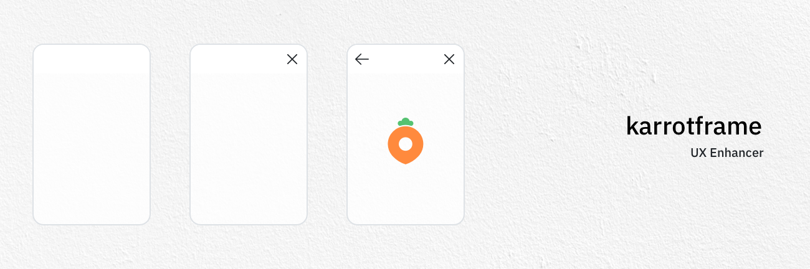

## 시작하기

```bash
$ yarn add karrotframe
```

```typescript
import { ... } from 'karrotframe'
```

## 1. 네비게이터
네비게이터는 아래의 기능을 지원합니다.

- History 지원
- 각 플랫폼에 맞게 디자인된 자연스러운 화면전환
- 각 플랫폼에 맞게 디자인된 네비게이션 바
- 상황에 맞는 이전, 닫기 버튼

> 네비게이터의 핵심 로직은 `react-router-dom`에 의존하고 있습니다.

### 1-a. `Navigator`
`Navigator` 컴포넌트는 화면을 표현하는데 반드시 필요한 요소들이 포함됩니다. 컴포넌트 트리 상단에 포함해주세요

```tsx
import { Navigator } from 'karrotframe'

const App: React.FC = () => {
  return (
    <Navigator
      theme='Cupertino'
      onClose={() => {
        console.log('닫기버튼이 눌렸습니다')
      }}
    >
      {/*...*/}
    </Navigator>
  )
}
```

| Props | 타입 | 역할 | 기본값 |
| ------------- | ------------- | ------------- | ------------- | 
| `theme` | `Cupertino` 또는 `Android` | UI 테마 | `Android` |
| `animationDuration` | number | 애니메이션 지속시간  | `theme` 별로 다름 |
| `useCustomRouter` | boolean | `true`인 경우 `Navigator` 내에 포함된 `<HashRouter/>` 을 제거합니다  ||
| `onClose` | `() => void` | 루트의 닫기 버튼이 클릭될때 해당 함수가 호출됩니다 ||
| `onDepthChange` | `(height: number) => void` | 네비게이션 깊이가 변경될때마다 해당 함수가 호출됩니다 ||

### 1-b. `Screen`
`Screen` 컴포넌트는 화면을 선언하는데 사용합니다. `Navigator` 안에 선언합니다.

```tsx
import { Navigator, Screen } from 'karrotframe'

const App: React.FC = () => {
  return (
    <Navigator
      theme='Cupertino'
      onClose={() => {
        console.log('닫기버튼이 눌렸습니다')
      }}
    >
      <Screen path='/' component={MyComponent} />
      {/* 또는 */}
      <Screen path='/'>
        <MyComponent />
      </Screen>
    </Navigator>
  )
}
```
| Props | 타입 | 역할 | 기본값 |
| ------------- | ------------- | ------------- | ------------- | 
| `path` | string | 해당 화면을 표현할 Path | required |
| `component` | `React.ComponentType<ScreenComponentProps>` | 렌더링 할 컴포넌트 ||
| `children` | `React.ReactNode` | 렌더링 할 요소  ||
> `component` 또는 `children`은 반드시 사용하세요 (만약 두 props가 동시에 선언되는 경우, `component`가 우선권을 갖습니다)

> `ScreenComponentProps`를 통해 스크린에 대한 정보를 받아올 수 있습니다

  ```tsx
  import { ScreenComponentProps } from 'karrotframe'

  const MyComponent: React.FC<ScreenComponentProps> = (props) => {
    console.log(isTop) // 현재 최상단인지 여부
    console.log(isRoot) // 현재 첫 페이지인지 여부
  }
  ```

### 1-c. `ScreenHelmet`
기본적으로 Screen은 상단 네비게이션 바를 포함하고 있지 않습니다. 기본 제공되는 상단 네비게이션 바를 추가, 수정하기 위해서는 `ScreenHelmet` 컴포넌트를 사용하세요.

```tsx
import { ScreenHelmet } from 'karrotframe'

const MyComponent: React.FC = () => {
  return (
    <div>
      <ScreenHelmet
        title='당근알바'
        appendLeft={
          <div>왼쪽에추가</div>
        }
        appendRight={
          <div>오른쪽에추가</div>
        }
        customBackButton={
          <div>이전</div>
        }
        customCloseButton={
          <div>닫기</div>
        }
      />
    </div>
  )
}
```
| Props | 타입 | 역할 | 기본값 |
| ------------- | ------------- | ------------- | ------------- | 
| `title` | `React.ReactNode` | 타이틀 부분에 출력할 요소 ||
| `appendLeft` | `React.ReactNode` | 왼쪽에 요소를 추가 (이전 버튼 오른쪽에 표시됩니다) ||
| `appendRight` | `React.ReactNode` | 오른쪽에 요소를 추가 (닫기 버튼 왼쪽에 표시됩니다) ||
| `closeButtonLocation` | `left` 또는 `right` | 이전 버튼을 사용자화합니다 | `left` |
| `customBackButton` | `React.ReactNode` | 이전 버튼을 사용자화합니다 ||
| `customCloseButton` | `React.ReactNode` | 닫기 버튼을 사용자화합니다 ||

### 1-d. `Link`
특정 path로 이동할 수 있는 링크를 생성하는 컴포넌트입니다.

```tsx
import { Link } from 'karrotframe'

const Home: React.FC = () => {
  return (
    <div>
      <Link to='/posts'>글 목록</Link>
    </div>
  )
}
```
| Props | 타입 | 역할 | 기본값 |
| ------------- | ------------- | ------------- | ------------- | 
| `to` | string | 이동 할 path | required |
| `className` | string | className | `undefined` |
| `replace` | boolean | path 이동을 replace로 처리할 지 여부 | `undefined` |
| `present` | boolean | 스와이프 백이 불가능한 새 창으로 엽니다 (Cupertino Only) | `undefined` |

### 1-e. `useLocation`, `useParams`, `useRouteMatch`
react-router-dom에 존재하는 `useLocation`, `useParams`, `useRouteMatch`를 사용할 수 있습니다

```tsx
import { useLocation, useParams, useRouteMatch } from 'react-router-dom'

const Post: React.FC = () => {
  /**
   * 현재 location 정보
   */
  const location = useLocation()

  /**
   * path parameter로 들어온 값
   */
  const params = useParams()

  /**
   * 현재 위치와 특정 path regex를 비교해 파싱된 값을 반환합니다.
   * (매치하지 않는다면 null 반환)
   */
  const match = useRouteMatch({
    path: '/:post_id',
  })

  return /* ... */
}
```

### 1-f. `useQueryParams`, `useParams`
화면의 전환간 path의 변경으로 인해 의도하지 않은 화면의 변경이 발생하지 않도록 하기 위해, `useQueryParam`을 통해 querystring을 사용하고, `useParams`를 통해 path parameter를 사용할 수 있습니다.

```tsx
import { useQueryParams, useParams } from 'karrotframe'

const Post: React.FC = () => {
  /**
   * querystring으로 들어온 값 (화면 전환간 불변)
   */
  const querystring = useQueryParams()

  /**
   * path parameter로 들어온 값 (화면 전환간 불변)
   */
  const params = useParams()

  return /* ... */
}
```

### 1-g. `useNavigator`
화면 전환을 수행합니다.

```tsx
import { useNavigator } from 'karrotframe'

const Posts: React.FC = () => {
  const { push, pop, replace } = useNavigator()

  const goPost = (postId: string) => () => {
    // 특정 path로 이동합니다
    push(`/posts/${postId}`)

    // 특정 path을 스와이프 백이 불가능한 새 창으로 띄웁니다 (Cupertino Only)
    push(`/posts/${postId}`, {
      present: true,
    })
  }

  const goBack = () => {
    // 한단계 뒤로 갑니다
    pop()

    // depth argument를 통해 여러단계를 pop 할 수 있습니다
    pop(1)
  }

  useEffect(() => {
    if (!user) {
      // 특정 path로 이동합니다 (replace)
      // 애니메이션 없이 이동하므로, redirect behavior에 적절합니다
      replace('/login')
    }
  })

  return (
    <div>
      {posts.map((post) => {
        return (
          <div>
            {/* ... */}
            <button onClick={goPost(post.id)}>
              글 상세보기
            </button>
          </div>
        )
      })}
      {/* ... */}
      <button onClick={goBack}>뒤로가기</button>
    </div>
  )
}
```

추가적으로, `useNavigator`의 `pop().send()`과 `await push()`를 통해 화면간 데이터 전송을 할 수 있습니다.

> `pop()` 함수 내 `depth` argument를 2 이상으로 부여할 시 여러 화면을 뛰어넘어서 전송도 가능합니다.

```tsx
import { useNavigator } from 'karrotframe'

const Posts: React.FC = () => {
  const { push } = useNavigator()

  const writePost = () => {
    // 다음 화면에서 전송할 데이터를 기다립니다
    const data = await push('/posts/write')
    console.log(data)
    // {
    //   hello: 'world',
    // }
  }
  return (
    <div>
      <button
        onClick={writePost}
      >
        글 작성하기
      </button>
    </div>
  )
}

const PostWriteForm: React.FC = () => {
  const { pop } = useNavigator()

  const onSubmit = () => {
    // 이전 화면으로 데이터 전송
    pop().send({
      hello: 'world',
    })

    // 아래와 같이 여러 단계를 뛰어넘어 데이터 전송도 가능합니다
    pop(3).send({
      hello: 'world',
    })
  }

  return /* ... */
}
```
### 1-e. `react-router-dom`
`react-router-dom`의 기본 컴포넌트와 함수들을 다음과 같이 함께 사용할 수 있습니다.

#### 라우터 교체하기
```tsx
import { Navigator } from 'karrotframe'
import { HashRouter } from 'react-router-dom'

const App = () => {
  return (
    <HashRouter>
      <Navigator useCustomRouter>
        ...
      </Navigator>
    </HashRouter>
  )
}
```

#### Screen 내부에서 라우팅하기

```tsx
// <Screen path={ExampleScreen} />

import { Route, useHistory } from 'react-router-dom'

const ExampleScreen = () => {
  const history = useHistory()

  const moveToInside2 = () => {
    history.push('/.../inside2')
  }
  const goBack = () => {
    history.goBack()
  }
  const goBackFurther = () => {
    // 현재 내부 라우팅과 이전 Karrotframe 스크린 전환을 통합해서
    // 뒤로가기 할 수 있습니다.
    history.go(-4)
  }

  return (
    <div>
      <Route path='/.../inside1'>...</Route>
      <Route path='/.../inside2'>...</Route>
    </div>
  )
}
```

> path 내에 `_si` 쿼리스트링이 포함되어있지 않으면 Karrotframe은 내부 라우팅으로 인식해 별도의 애니메이션 처리를 위한 작업을 하지 않습니다

## Contributor
- Bucky (bucky@daangn.com)
- Tony (tony@daangn.com)
- Victor (victor@daangn.com)
- Steve (steve@daangn.com)
