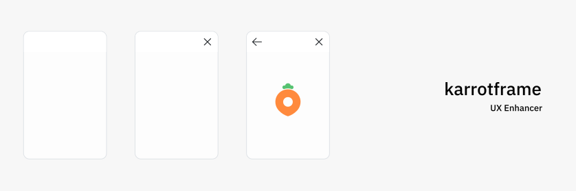

## Packages

- [`@karrotframe/navigator`](./packages/navigator)
- [`@karrotframe/tabs`](./packages/tabs)

## Contributors

- Bucky (bucky@daangn.com)
- Tony (tony@daangn.com)
- Victor (victor@daangn.com)
- Steve (steve@daangn.com)
- Tim (tim@daangn.com)
- [woochanleee](https://github.com/woochanleee)
- [Ryz0nd](https://github.com/Ryz0nd)

## Contribution Guide

Karrotframe에 새 기능 또는 옵션을 Contribute 하시려면 [Contribution Guide](./CONTRIBUTING.md)를 확인하세요
