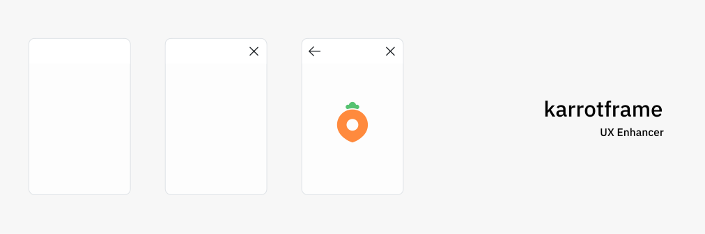

<div align="center">


</div>

**Light-weight stack navigator for React**

- 🗂 History support
- 💅 Beautiful page transition animation designed for each platform (Android/iOS)
- ⚙️ Navigation bar designed for each platform
- 🪄 Automatically attach close or back button for each circumstance

> Core logic of Navigator depends on `react-router-dom`

---

- [Setup](#setup)
- [Components](#components)
  - [Navigator](#navigator)
  - [Screen](#screen)
  - [ScreenHelmet](#screen-helmet)
- [Hooks](#hooks)
  - [useNavigator](#usenavigator)
  - [useCurrentScreen](#usecurrentscreen)
  - [useParams](#useParams)
  - [useQueryParams](#usequeryparams)
- [Advance](#advance)
  - [Nested Routes](#nested-routes)
  - [`await push()`](#await-push)
  - [`react-router-dom` APIs](#react-router-dom-apis)

---

## Setup

```bash
$ yarn add @karrotframe/navigator
```

Should import the CSS of your app

```typescript
import '@karrotframe/navigator/index.css'

import { ... } from '@karrotframe/navigator'
```

## Components

### Navigator

The `Navigator` component includes elements that are necessary to express the screen. Please include it at the top of the component tree

> All the props is typed and commented in TypeScript

```tsx
import { Navigator } from '@karrotframe/navigator'

const App: React.FC = () => {
  return (
    <Navigator
      theme="Cupertino"
      onClose={() => {
        console.log('Close button is pressed')
      }}
    >
      {/*...*/}
    </Navigator>
  )
}
```

> If you use the useCustomRouter option, you can provide a router other than HashRouter.

```tsx
import { Navigator } from '@karrotframe/navigator'
import { HashRouter } from 'react-router-dom'

const App = () => {
  return (
    <HashRouter>
      <Navigator useCustomRouter>...</Navigator>
    </HashRouter>
  )
}
```

### Screen

The `Screen` component is used to declare a screen. Declare it inside `Navigator`.

> All the props is typed and commented in TypeScript

```tsx
import { Navigator, Screen } from '@karrotframe/navigator'

const App: React.FC = () => {
  return (
    <Navigator
      theme="Cupertino"
      onClose={() => {
        console.log('Close button is pressed')
      }}
    >
      <Screen path="/" component={MyComponent} />
      {/* or */}
      <Screen path="/">
        <MyComponent />
      </Screen>
    </Navigator>
  )
}
```

Be sure to use `component` or `children` (if both props are declared at the same time, `component` takes precedence)

### ScreenHelmet

By default, Screen does not include a top navigation bar. To add or modify the built-in top navigation bar, use the `ScreenHelmet` component.

> All the props is typed and commented in TypeScript

```tsx
import { ScreenHelmet } from '@karrotframe/navigator'

const MyComponent: React.FC = () => {
  return (
    <div>
      <ScreenHelmet
        title="My App"
        appendLeft={<div>Append to Left</div>}
        appendRight={<div>Append to Right</div>}
        customBackButton={<div>Back</div>}
        customCloseButton={<div>Close</div>}
      />
    </div>
  )
}
```

## Hooks

### useNavigator

Trigger a screen transition.

> All arguments are typed and commented in TypeScript

```tsx
import { useNavigator } from '@karrotframe/navigator'

const Posts: React.FC = () => {
  const { push, pop, replace } = useNavigator()

  const goPost = (postId: string) => () => {
    // Go to a specific path
    push(`/posts/${postId}`)

    // Opens a specific path in a new window that cannot be swipe back (Cupertino theme only)
    push(`/posts/${postId}`, {
      present: true,
    })
  }

  const goBack = () => {
    // Go one step back
    pop()

    // Multiple levels can be popped through the depth argument
    pop(1)
  }

  useEffect(() => {
    if (!user) {
      // Move to a specific path (replace)
      // It moves without animation, so it is suitable for redirect behavior.
      replace('/login')
    }
  })

  return (
    <div>
      {posts.map((post) => {
        return (
          <div>
            {/* ... */}
            <button onClick={goPost(post.id)}>View article details</button>
          </div>
        )
      })}
      {/* ... */}
      <button onClick={goBack}>Back</button>
    </div>
  )
}
```

### useCurrentScreen

Get current screen's information

> All arguments are typed and commented in TypeScript

```tsx
import { useCurrentScreen } from '@karrotframe/navigator'

const Posts: React.FC = () => {
  const { isTop, isRoot } = useCurrentScreen()

  return (
    <div>
      {isTop && <span>This screen is in top</span>}
      {isRoot && <span>This screen is in root</span>}
    </div>
  )
}
```

### useParams

To prevent unintentional screen changes due to changes in the path between screen transitions, you can use a path parameter through `useParams`.

> All arguments are typed and commented in TypeScript

```tsx
import { useParams } from '@karrotframe/navigator'

const Post: React.FC = () => {
  /**
   * Value entered as path parameter (not changed in screen transitions)
   */
  const params = useParams()

  return /* ... */
}
```

### useQueryParams

To prevent unintentional screen changes due to changes in the path between screen transitions, you can use a querystring through `useQueryParams`.

> All arguments are typed and commented in TypeScript

```tsx
import { useQueryParams } from '@karrotframe/navigator'

const Post: React.FC = () => {
  /**
   * Value entered as querystring (not changed in screen transitions)
   */
  const querystring = useQueryParams()

  return /* ... */
}
```

## Advance

### Nested Routes

Use `Route` in `react-router-dom`

```tsx
// <Screen path='/example' component={ExampleScreen} />

import { Route, useHistory } from 'react-router-dom'

const ExampleScreen = () => {
  const history = useHistory()

  const moveToInside2 = () => {
    history.push('/example/inside2')
  }
  const goBack = () => {
    history.goBack()
  }
  const goBackFurther = () => {
    // You can go back by integrating the current internal routing
    // with the previous Karrotframe screen transitions.
    history.go(-4)
  }

  return (
    <div>
      <Route path="/example/inside1">...</Route>
      <Route path="/example/inside2">...</Route>
    </div>
  )
}
```

> If the `_si` query string is not included in the path, Karrotframe recognizes it as an internal routing and does not perform any separate animation processing.

### `await push()`

You can transfer data between screens through `pop().send()` and `await push()` of `useNavigator`.

> When the `depth` argument in the `pop()` function is set to 2 or more, it is possible to send over multiple screens.

```tsx
import { useNavigator } from '@karrotframe/navigator'

const Posts: React.FC = () => {
  const { push } = useNavigator()

  const writePost = () => {
    // Wait for the data to be sent from the next screen
    const data = await push('/posts/write')
    console.log(data)
    // {
    //   hello: 'world',
    // }
  }
  return (
    <div>
      <button onClick={writePost}>Write post</button>
    </div>
  )
}

const PostWriteForm: React.FC = () => {
  const { pop } = useNavigator()

  const onSubmit = () => {
    // Transfer data to previous screen
    pop().send({
      hello: 'world',
    })

    // It is also possible to transfer data by skipping several steps as shown below.
    pop(3).send({
      hello: 'world',
    })
  }

  return /* ... */
}
```

### `react-router-dom` APIs

You can use `useLocation`, `useRouteMatch` and `useHistory` that exist in react-router-dom.

```tsx
import { useLocation, useHistory, useRouteMatch } from 'react-router-dom'

const Post: React.FC = () => {
  /**
   * Current location information
   */
  const location = useLocation()

  /**
   * History API
   */
  const history = useHistory()

  /**
   * Compares the current location with a specific path regex and returns the parsed value.
   */
  const match = useRouteMatch({
    path: '/:post_id',
  })

  return /* ... */
}
```
