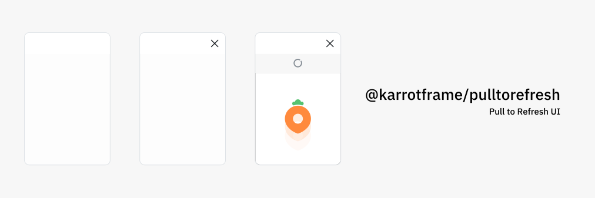

<div align="center">


</div>

**Pull to Refresh UI for React**

---

- [Setup](#setup)
- [Components](#components)
- [Hooks](#hooks)

---

## Setup

```bash
$ yarn add @karrotframe/pulltorefresh
```

Should import the CSS of your app

```typescript
import '@karrotframe/pulltorefresh/index.css'

import { ... } from '@karrotframe/pulltorefresh'
```

## Components

## Hooks
