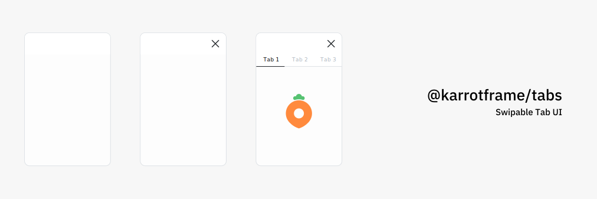

<div align="center">


</div>

**Swipable Tab UI for React**

---

- [Setup](#setup)
- [Components](#components)
  - [Tabs](#tabs)
- [Hooks](#hooks)
  - [useTabsController](#usetabscontroller)

---

## Setup

```bash
$ yarn add @karrotframe/tabs
```

Should import the CSS of your app

```typescript
import '@karrotframe/tabs/index.css'

import { ... } from '@karrotframe/tabs'
```

## Components

### Tabs

> All the props is typed and commented in TypeScript

```tsx
import { Tabs } from '@karrotframe/tabs'
import { useState } from 'react'

const App: React.FC = () => {
  const [activeTabKey, setActiveTabKey] = useState<string>('tab_1')

  return (
    <Tabs
      activeTabKey={activeTabKey}
      tabs={[
        {
          key: 'tab_1',
          buttonLabel: 'Tab 1'
          render() {
            return (
              <div>Tab 1</div>
            )
          }
        }
      ]}
      onTabChange={(key) => {
        setActiveKey(key)
      }}
    />
  )
}

export default App
```

## Hooks

### useTabsController

```tsx
import { useTabsController } from '@karrotframe/tabs'

const Something: React.FC = () => {
  const { enableSwipe, disableSwipe } = useTabsController()

  const onTouchDown = () => {
    // disable swipe when other action needed
    disableSwipe()

    // ...
  }

  return (
    // ...
  )
}
```
